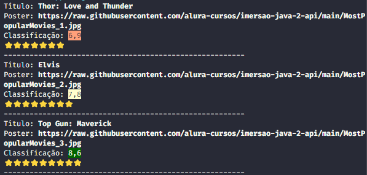

# Imersão Java com a Alura

## Objetivo do projeto
Esse pequeno, porém robusto projeto tem como objetivo explorar algumas possibilidades de uma aplicação web com Java

## Conteúdo já aplicado
### Aula 01 - Consumindo API de filmes com Java
---
**Conteúdo da aula**  
Nessa aula foram apresentados alguns recursos de requisição HTTP, bem como algumas formas de converter JSON em uma lista de itens e apresentá-los no console do navegador.

---
**Desafios**  
1. Cumprido o desafio de customizar a cor de fonte e fundo das informações apresentadas no console;
2. Cumprido o desafio de separar a informação da API em um arquivo de configuração. Para isso, foi utilizado o pacote `java.io.FileInputStream`.

**Adicionais aos desafios**  
- Para o desafio 1, foi implementada também uma simples lógica que modifica a cor de destaque da classificação do filme. As notas são apresentadas em 3 cores diferente (Salmão, Amarela e Verde), dependendo do nível de classificação;
- Para o desafio 2, além de remover a informação da URL da classe principal, foi criada uma nova classe para para obter dinamicamente valor valor de alguma key no arquivo de configuração.

